# 🚀 DevOps CI/CD Pipeline Monitor & Alerting System


> A production-grade DevOps automation platform that monitors CI/CD pipelines,
> sends real-time alerts on failures, auto-retries failed builds,
> and deploys to AWS EKS using GitOps — fully automated end to end.

---

## 📌 Problem Statement

In modern software teams, developers push code multiple times a day.
Without proper monitoring:

- ❌ Build failures go unnoticed for hours
- ❌ Failed deployments require manual intervention
- ❌ No visibility into pipeline health across services
- ❌ Teams waste time manually checking Jenkins
- ❌ No automatic retry when builds fail due to temporary issues

## ✅ Solution

This platform **fully automates the CI/CD lifecycle** by:

- ✅ Monitoring all Jenkins pipelines in real-time
- ✅ Sending instant Slack and email alerts on failures
- ✅ Auto-retrying failed builds up to 3 times
- ✅ Generating daily build reports automatically
- ✅ Deploying everything to AWS EKS via GitOps
- ✅ Providing live dashboards via Grafana

---

## 🏗️ Architecture Diagram

```mermaid
%%{
  init: {
    'theme': 'dark',
    'themeVariables': {
      'background': '#0b0f19',
      'primaryColor': '#1e293b',
      'primaryTextColor': '#f8fafc',
      'lineColor': '#475569',
      'edgeLabelBackground': '#0f172a',
      'tertiaryColor': '#0f172a'
    }
  }
}%%
graph TB
    %% ==========================================
    %% GLOBAL STYLES & DEFINITIONS
    %% ==========================================
    classDef actor fill:#1e3a8a,stroke:#3b82f6,stroke-width:2px,color:#fff;
    classDef git fill:#991b1b,stroke:#ef4444,stroke-width:1px,color:#fff;
    classDef ci fill:#854d0e,stroke:#eab308,stroke-width:1px,color:#fff;
    classDef registry fill:#c2410c,stroke:#f97316,stroke-width:1px,color:#fff;
    classDef cd fill:#7c2d12,stroke:#ea580c,stroke-width:2px,color:#fff;
    
    classDef ingress fill:#0369a1,stroke:#0ea5e9,stroke-width:2px,color:#fff;
    classDef app fill:#334155,stroke:#94a3b8,stroke-width:1px,color:#fff;
    classDef db fill:#020617,stroke:#2563eb,stroke-width:2px,color:#38bdf8;
    classDef obs fill:#166534,stroke:#22c55e,stroke-width:1px,color:#fff;

    %% ==========================================
    %% DEV & DEVOPS PIPELINE TIER
    %% ==========================================
    DEV[👨‍💻 Platform Developer]:::actor
    REPO_SRC[🌐 GitHub: Application Source]:::git
    JENKINS[🤖 Jenkins Build Server]:::ci
    ECR[📦 AWS Elastic Container Registry]:::registry
    REPO_MAN[🗂️ GitHub: GitOps Manifests]:::git
    ARGOCD[🐙 ArgoCD Deployment Engine]:::cd

    %% Pipeline Logic Links
    DEV -->|1. git push| REPO_SRC
    REPO_SRC -->|2. Webhook Trigger| INGRESS
    JENKINS -->|3a. Push Image| ECR
    JENKINS -->|3b. Update Image Tag| REPO_MAN
    REPO_MAN -->|4. Pull State| ARGOCD
    ARGOCD -->|5. Declarative Sync| INGRESS

    %% ==========================================
    %% AWS EKS CLUSTER SUBGRAPH
    %% ==========================================
    subgraph EKS [☸️ AWS EKS PRODUCTION CLUSTER]
        
        %% Entry Point
        INGRESS[🌐 AWS ALB / NGINX Ingress Controller]:::ingress

        %% Application Tier (Public/Private Virtual Subnets)
        subgraph APP_TIER [📱 Application Services Subnet]
            UI[frontend-ui<br/>Port :80]:::app
            AUTH[auth-service<br/>Port :8081]:::app
            PIPE[pipeline-svc<br/>Port :8082]:::app
            ALER[alert-service<br/>Port :8083]:::app
            RETR[retry-service<br/>Port :8084]:::app
            REPO[report-service<br/>Port :8085]:::app
        end
        style APP_TIER fill:#0f172a,stroke:#475569,stroke-width:1px

        %% Data Tier (Private Isolated Subnet)
        subgraph DATA_TIER [🔒 Isolated Database Private Subnet]
            DB_AUTH[(mysql-auth)]:::db
            DB_PIPE[(mysql-pipeline)]:::db
            DB_ALER[(mysql-alert)]:::db
            DB_RETR[(mysql-retry)]:::db
            DB_REPO[(mysql-report)]:::db
        end
        style DATA_TIER fill:#020617,stroke:#1e3a8a,stroke-width:1px,stroke-dasharray: 5 5

        %% Traffic Routing Internal
        INGRESS --> UI
        INGRESS --> AUTH
        INGRESS --> PIPE

        %% Service to Database Explicit Topologies
        AUTH ===> DB_AUTH
        PIPE ===> DB_PIPE
        ALER ===> DB_ALER
        RETR ===> DB_RETR
        REPO ===> DB_REPO
    end
    style EKS fill:#030712,stroke:#0ea5e9,stroke-width:3px

    %% Jenkins to Cluster Boundary Hook
    INGRESS -.->|Webhook Proxy| JENKINS

    %% ==========================================
    %% OBSERVABILITY STACK
    %% ==========================================
    subgraph OBS_STACK [📊 Platform Observability Stack]
        PROM[Prometheus Server]:::obs
        GRAF[Grafana Dashboards]:::obs
        AM[AlertManager Core]:::obs
        
        PROM --> GRAF
        PROM --> AM
    end
    style OBS_STACK fill:#030712,stroke:#22c55e,stroke-width:2px

    %% Telemetry Links
    APP_TIER -.->|6. Scrape Metrics| PROM

    %% ==========================================
    %% LINK STYLES (Enforces High-Contrast Colors)
    %% ==========================================
    linkStyle 0,1,2,3,4,5 stroke:#0ea5e9,stroke-width:2.5px;
    linkStyle 6,7,8 stroke:#38bdf8,stroke-width:1.5px;
    linkStyle 9,10,11,12,13 stroke:#2563eb,stroke-width:2px;
    linkStyle 14 stroke:#f59e0b,stroke-width:1.5px,stroke-dasharray: 4 4;
    linkStyle 17 stroke:#22c55e,stroke-width:1.5px,stroke-dasharray: 5 5;
```

## 📸 Live Dashboard Screenshots

<p align="center">
  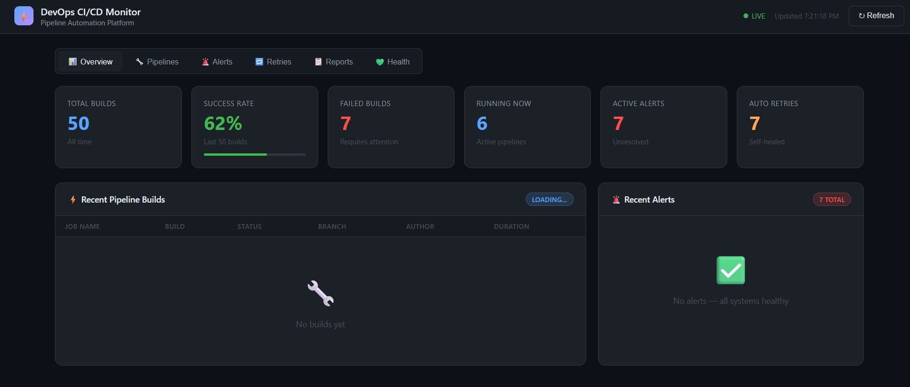
  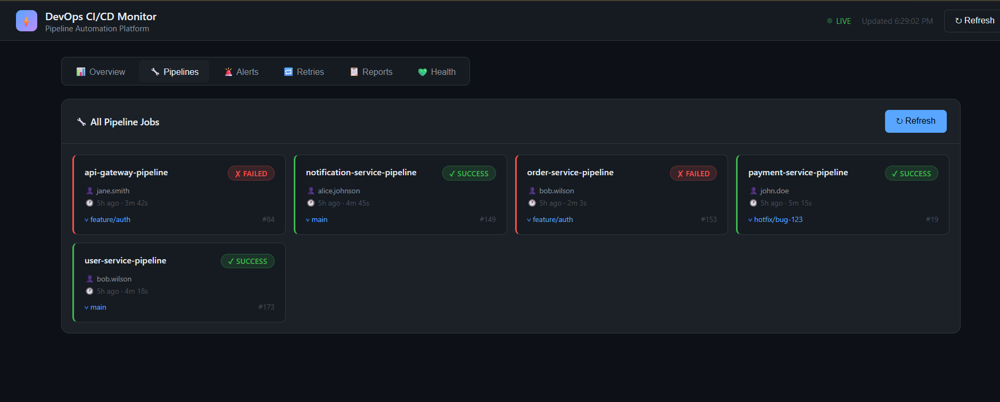
</p>
<p align="center">
  <sub><b>Overview</b> — build stats, success rate, active alerts at a glance &nbsp;|&nbsp; <b>Pipelines</b> — live status of every CI/CD job</sub>
</p>

<p align="center">
  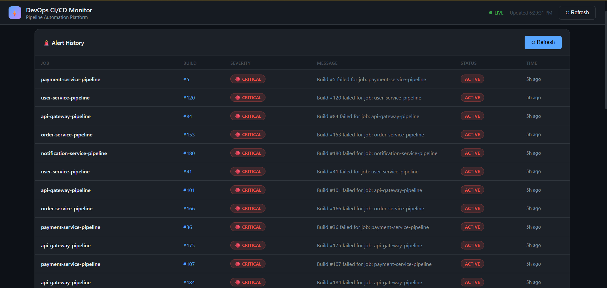
  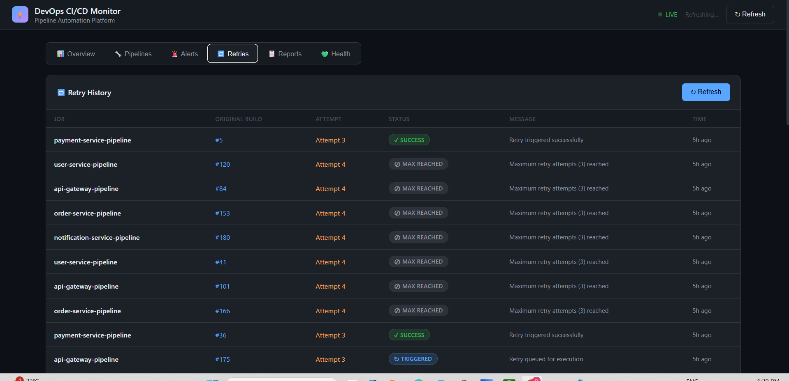
</p>
<p align="center">
  <sub><b>Alerts</b> — real-time critical failure history &nbsp;|&nbsp; <b>Retries</b> — auto-retry attempts and outcomes</sub>
</p>

<p align="center">
  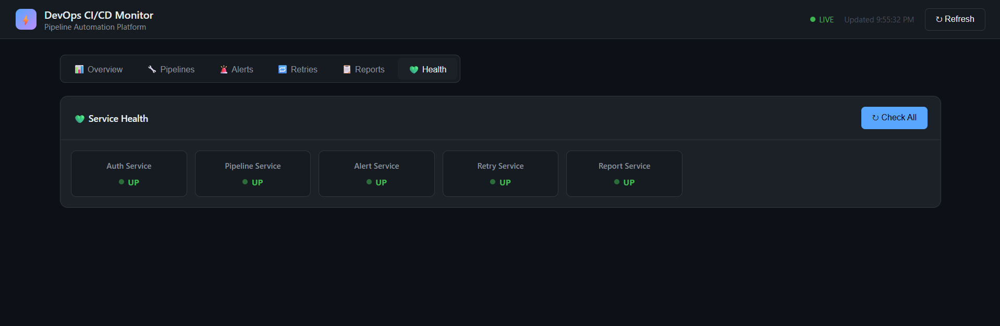
</p>
<p align="center">
  <sub><b>Health</b> — live UP/DOWN status of all 5 microservices</sub>
</p>

---

## 🛠️ Tech Stack

| Category | Technology | Purpose |
|----------|-----------|---------|
| **Language** | Java 17 + Spring Boot 3 | Microservices backend |
| **Frontend** | HTML + CSS + JS + Nginx | Dashboard UI |
| **Containerisation** | Docker | Package services into images |
| **CI/CD** | Jenkins + Jenkinsfile | Automated build and push pipeline |
| **Image Registry** | AWS ECR | Store versioned Docker images |
| **Infrastructure** | Terraform | Provision all AWS resources as code |
| **Cloud** | AWS (EKS, VPC, ECR, IAM, EBS) | Production cloud platform |
| **Orchestration** | Kubernetes (EKS) | Run and manage containers |
| **Packaging** | Helm | Package and deploy K8s manifests |
| **GitOps** | ArgoCD | Auto-sync GitHub to EKS |
| **Ingress** | Nginx Ingress Controller | Route traffic to services |
| **Monitoring** | Prometheus | Collect metrics from all pods |
| **Dashboards** | Grafana | Visualise metrics in real-time |
| **Alerting** | AlertManager | Fire alerts on CPU/memory/pod issues |
| **Database** | MySQL 8 (StatefulSet) | Persistent storage per service |
| **Security** | JWT + IAM + IRSA | Authentication and authorisation |
| **Source Control** | GitHub + Webhooks | Code versioning and CI triggers |

---

## 📁 Project Structure

```text
devops-cicd-monitor/
├── auth-service/           # JWT authentication service
│   ├── src/                # Java source code
│   └── Dockerfile          # Container build instructions
├── pipeline-service/       # Jenkins pipeline monitoring
├── alert-service/          # Slack + email alerting
├── retry-service/          # Auto-retry failed builds
├── report-service/         # Daily build reports
├── frontend/               # HTML/CSS/JS dashboard
│   ├── index.html          # Main dashboard page
│   └── nginx.conf          # Nginx configuration
├── helm/                   # Kubernetes packaging
│   └── cicd-monitor/       # Main Helm chart
│       ├── Chart.yaml      # Chart metadata
│       ├── values.yaml     # Configuration values
│       └── templates/      # K8s manifest templates
│           ├── deployment.yaml  # Pod definitions
│           ├── service.yaml     # Network exposure
│           ├── configmap.yaml   # Environment variables
│           ├── hpa.yaml         # Auto scaling rules
│           ├── ingress.yaml     # Traffic routing
│           └── mysql.yaml       # Database StatefulSets
└── terraform/              # AWS Infrastructure as Code
    ├── main.tf             # Provider + S3 backend
    ├── variables.tf        # All configurable values
    ├── vpc.tf              # Network architecture
    ├── eks.tf              # EKS cluster + nodes
    ├── iam.tf              # IAM roles + policies
    └── ecr.tf              # Container registries
```

---

## ⚙️ Prerequisites

Before running this project make sure you have:

| Tool | Version | Purpose |
|------|---------|---------|
| AWS CLI | v2+ | Interact with AWS services |
| Terraform | v1.0+ | Provision infrastructure |
| kubectl | v1.28+ | Manage Kubernetes cluster |
| Helm | v3.0+ | Deploy Kubernetes packages |
| eksctl | v0.100+ | Manage EKS cluster |
| Docker | v20+ | Build container images |
| Java | 17 | Build Spring Boot services |

Also required:
- AWS Account with IAM user credentials configured
- GitHub repository forked or cloned
- Jenkins EC2 instance running with credentials configured

---

## 🚀 How to Run

### Step 1 — Start Jenkins EC2
```
AWS Console → EC2 → Jenkins instance → Start
```

### Step 2 — Run Jenkins Pipeline
```
Jenkins Dashboard → your pipeline job → Build Now
Wait for all stages to show green
This builds and pushes all Docker images to ECR
```

### Step 3 — Deploy Everything
```bash
cd devops-cicd-monitor
./deploy.sh
```

This single script will:
- ✅ Create all AWS infrastructure with Terraform
- ✅ Connect kubectl to EKS cluster
- ✅ Deploy all 6 services via Helm
- ✅ Install Prometheus + Grafana + AlertManager
- ✅ Install and configure ArgoCD
- ✅ Print Load Balancer URL when complete

### Step 4 — Access the Dashboard
```
Open browser → http://LOAD_BALANCER_URL
```

### Step 5 — Access Grafana
```bash
kubectl port-forward svc/monitoring-grafana -n monitoring 3000:80
```
```
Open browser → http://localhost:3000
Username: admin
Password: admin123
```

### Step 6 — Access ArgoCD
```bash
kubectl port-forward svc/argocd-server -n argocd 9000:443
```
```
Open browser → https://localhost:9000
Username: admin
```

---

## 💥 How to Destroy

### Step 1 — Stop Jenkins EC2
```
AWS Console → EC2 → Jenkins instance → Stop
```

### Step 2 — Run Destroy Script
```bash
cd devops-cicd-monitor
./destroy.sh
```

This single script will:
- ✅ Delete all Kubernetes namespaces
- ✅ Wait for Load Balancer to be released
- ✅ Delete leftover ELB security groups
- ✅ Destroy all Terraform infrastructure
- ✅ No stuck VPCs or dangling resources

> ⚠️ **Warning:** This deletes ALL AWS resources including
> ECR images, EKS cluster, VPC and all data.
> Run Jenkins pipeline again before next deploy.sh run.

---

## ✨ Key Features

| Feature | Description |
|---------|-------------|
| **Real-time Monitoring** | Dashboard shows live pipeline status across all services |
| **Instant Alerts** | Slack and email notifications on build failures |
| **Auto Retry** | Failed builds automatically retried up to 3 times |
| **Daily Reports** | Automated build summary report generated every day at 8am |
| **GitOps** | ArgoCD auto-deploys on every git push to main branch |
| **Self Healing** | Kubernetes restarts crashed pods automatically |
| **Auto Scaling** | HPA scales pods based on CPU utilisation |
| **IaC** | Entire AWS infrastructure provisioned with single command |
| **Observability** | Prometheus metrics, Grafana dashboards, AlertManager alerts |
| **Security** | JWT auth, IAM least privilege, private subnets, IRSA |

---

## 🌐 Microservices Overview

| Service | Port | Responsibility |
|---------|------|---------------|
| **auth-service** | 8081 | JWT login, registration, role-based access (ADMIN/VIEWER) |
| **pipeline-service** | 8082 | Polls Jenkins API every 60s, stores build history |
| **alert-service** | 8083 | Sends Slack and email alerts on build failures |
| **retry-service** | 8084 | Auto-retries failed builds up to 3 attempts |
| **report-service** | 8085 | Generates daily build reports at 8am via cron |
| **frontend** | 80 | HTML/CSS/JS dashboard served via Nginx |

---

## 📊 Monitoring & Observability

- **Prometheus** — scrapes metrics from all pods every 15 seconds
- **Grafana** — pre-built Kubernetes dashboards showing CPU, memory, pod health
- **AlertManager** — fires alerts when CPU > 80%, pods crash or memory pressure detected
- **Access Grafana:** `kubectl port-forward svc/monitoring-grafana -n monitoring 3000:80`

<p align="center">
  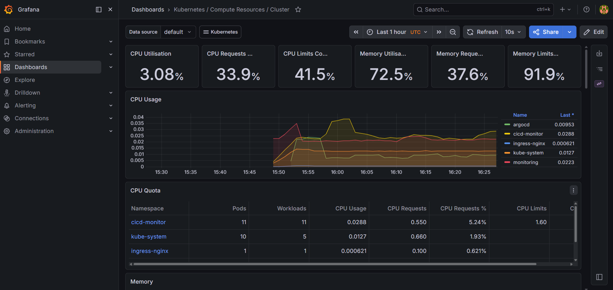
  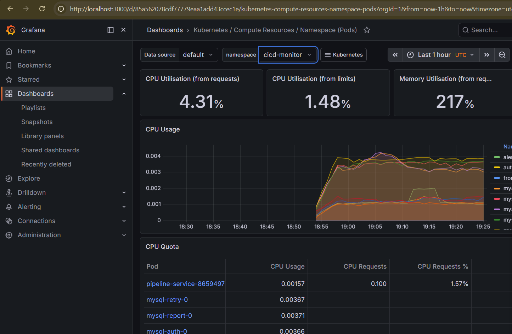
</p>
<p align="center">
  <sub><b>Cluster-wide</b> compute resources &nbsp;|&nbsp; <b>Namespace-level</b> CPU/memory for cicd-monitor</sub>
</p>

<p align="center">
  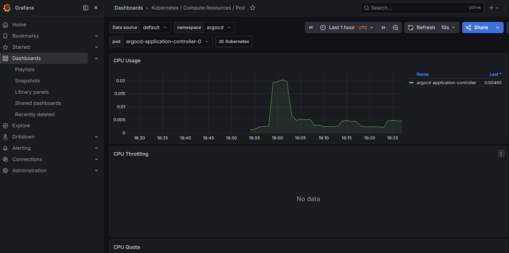
  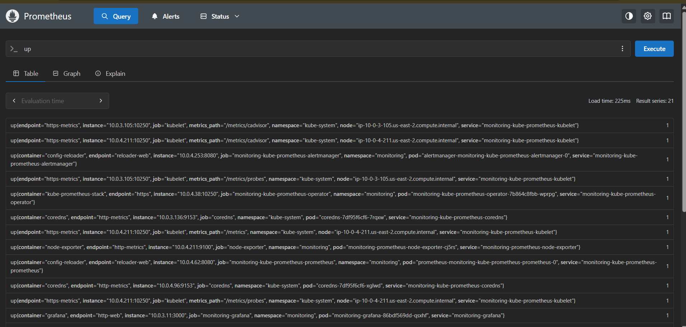
</p>
<p align="center">
  <sub><b>Pod-level</b> CPU usage for ArgoCD controller &nbsp;|&nbsp; <b>Prometheus</b> scrape targets, all healthy</sub>
</p>

### GitOps Sync Status

<p align="center">
  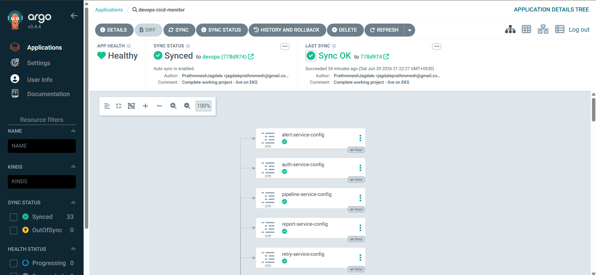
</p>
<p align="center">
  <sub>ArgoCD — application <b>Healthy</b> and <b>Synced</b>, auto-sync enabled across all service configs</sub>
</p>

---

## 🔐 Security Highlights

- JWT-based authentication with role-based access control (ADMIN/VIEWER)
- EKS worker nodes deployed in **private subnets** — not exposed to internet
- IAM roles with **least privilege** — each role has only required permissions
- **IRSA** (IAM Roles for Service Accounts) — pod level AWS permissions
- ECR image scanning enabled — every push scanned for vulnerabilities
- All inter-service communication inside private VPC network

---

## 👨‍💻 Author

**Prathmmesh Jagdale**
- GitHub: [PrathmmeshJagdale](https://github.com/PrathmmeshJagdale)
- LinkedIn: [PrathmmeshJagdale](https://www.linkedin.com/in/prathmmesh-jagdale)

---

## 📄 License

This project is built for learning and portfolio purposes.

---

*Built with ❤️ using AWS, Kubernetes, Terraform, Jenkins, Helm, ArgoCD, Prometheus and Grafana*
